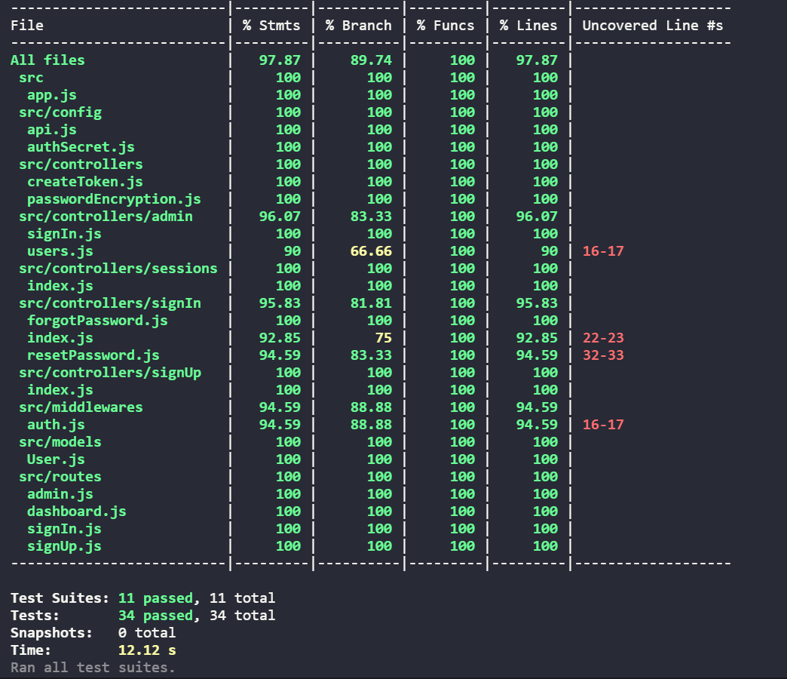

# Backend built in nodejs, through TDD tests.

## [API DOCS 📄](https://project-cryptodash.herokuapp.com/api-docs/)

## Data base:

- **MongoDB**

---

## Dependencies:

- **axios**
- **bcryptjs**
- **cors**
- **dotenv**
- **express**
- **googleapis**
- **jsonwebtoken**
- **mongoose**
- **nodemailer**
- **nodemailer-express-handlebars**

---

## DevDependencies:

- **@shelf/jest-mongodb**
- **jest**
- **nodemon**
- **supertest**

---

## Deploy link: https://project-cryptodash.herokuapp.com/

## Git Clone:

### First run the command to clone the project on your machine:

    git clone  https://github.com/anastaciom/backend-project-cryptocurrencies.git

### Enter the project folder:

    cd backend-project-cryptocurrencies

### Inside the "backend-project-cryptocurrencies" folder, install all dependencies by running:

    npm install

### Now, to run the project:

    npm start or npm run dev (nodemon)

### ⚠️⚠️ Don't forget to add your values in the environment variables. The variable names are in the ".env.example" file. ⚠️⚠️

### will run at http://localhost:3001/

---

## Test Report

---
